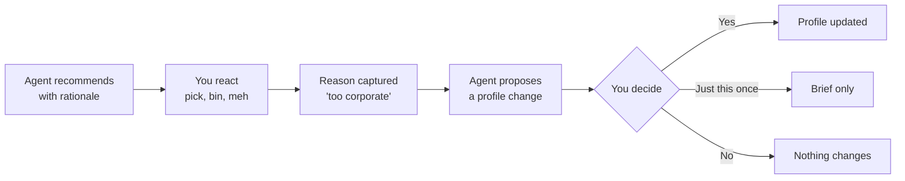

# Open Intent Profile: draft spec v0.1

**Status:** draft, published for comment · **First published:** 3 October 2026
**Author:** Matt Pollitt, [Swper](https://swper.studio)
**Licence:** [CC BY 4.0](https://creativecommons.org/licenses/by/4.0/)

---

## What this is (and why you should care)

The Open Intent Profile is a person-owned file that tells any shopping agent what you actually want. Not what an ad budget wants you to want.

Right now, the plumbing for agents buying stuff is being built at pace. UCP, ACP and AP2 define how agents read shops, check out and prove you said yes. What none of them define is the *person*. They all politely assume "the user's saved preferences" live somewhere, and then wander off. Usually into the platform's own pocket.

The nearest they get: UCP lets an agent pass a free-text hint about what the buyer is after, and has a consent for the shop to remember your preferences. ACP has a proposal for telling the seller why you backed out of a checkout. All useful. All either per-request or held by the seller. None is a profile the person owns and carries.

That's the gap. If your preferences live inside one company's agent, that agent works for that company. Put them in a file you own, and any agent you point at it works for you.

**One-liner:** open banking, but for what you're trying to buy.

**Why it matters beyond convenience:** agents don't have eyeballs to buy with ads. They have a brief and a rubric. Make the brief honest and portable, and the best product wins, not the loudest one. Small independent makers stop losing to logos. And if the brief says "repairable, buy once", making things that last becomes the way to get picked.

**And the bit underneath:** this isn't about helping people buy more. It's about helping them buy less, but better. The stuff that's genuinely theirs, not the stuff marketing told them to want so they'd look like someone else. Call it anti-consumerist consumerism. A good profile should make you *harder* to sell to, not easier.

## Principles

Five rules. If a feature breaks one, the feature loses.

1. **You own it.** The profile lives with the person, not the agent or the shop. Agents get scoped, revocable access, like open banking consents.
2. **Readable by humans, not just machines.** Every entry has a plain-English version. If you can't read your own profile over a cuppa, it's broken.
3. **Correctable, always.** You can see what an agent thinks you value and tell it it's wrong. No hidden weights.
4. **No silent learning.** Agents *propose* changes. You approve them. Nothing about you gets rewritten behind your back.
5. **Portable.** One profile, any agent. Switching agents shouldn't mean starting from scratch like a new dentist.

## The four parts

Three layers, slowest-moving at the top, plus a thread that ties them together. Lower layers inherit from higher ones unless you override them for a specific job.

| Part | What it holds | How fast it changes | How agents treat it |
| --- | --- | --- | --- |
| **Standing values** | Taste and ethics. "Independent makers over big brands." "Buy once, cry once." "No subscriptions, thanks." | Years | Weighed. A preference, not a rule. |
| **Standing constraints** | Hard facts. Sizes, budgets, things you can't use, brands ruled out, where you live. | Months | Filtered. Break one and the product's out. |
| **Active brief** | One job. "Winter coat, cycling commute, before November, under £200." | Days, then binned | Scoped to this task only. Can override standing stuff. |
| **Rationale trail** | For every recommendation, which values and constraints drove it. | Per recommendation | Mandatory. No rationale, no recommendation. |

The split between values and constraints matters. "I prefer wool" and "I can't wear wool" look similar in a database. They are very much not the same thing at a checkout.

The rationale trail is the bit that makes the rest trustworthy. If an agent can't point at *your* reason for picking something, it's picking for someone else's.

## The feedback loop

The gold isn't what you pick. It's why you binned the other four.



**Reactions are richer than yes/no.** "Love it, too pricey." "Right vibe, wrong colour." "Too corporate." Most shopping interfaces throw these away. This spec keeps them.

**Proposals, not assumptions.** After a pattern shows up, the agent asks: "You've binned the polished big-brand option three times. Make 'prefer independents' a standing value?"

**Three answers, not two:**

- **Yes** writes it to standing values or constraints.
- **Just this once** keeps it in the active brief and bins it afterwards.
- **No** leaves your values and constraints alone. The decline is recorded in the profile with a quiet-until date, so no agent asks about that pattern again until it lapses.

Every accepted change is logged in the profile's `history` with the date and what triggered it, so you can undo it later when you inevitably change your mind about beige.

## Modes: errand or wander

Sometimes shopping is a chore. Sometimes the wandering *is* the point. Every active brief carries a mode so the agent knows which one it's in.

| Mode | You want | Agent behaves like |
| --- | --- | --- |
| **Errand** | The right thing, fast, done. Loo roll. A replacement charger. | A ruthless PA. Fewest options, strongest rationale, buy when approved. |
| **Wander** | To browse, be surprised, discover. A new jacket. A Sunday. | A good shop assistant. More variety, deliberate wildcards, never buys on its own. |

In wander mode the agent is allowed to break your standing values a bit, on purpose, and tell you it did. "This one's big-brand, but it's the only one that does X." That's how you find things you didn't know you liked. Values only, never constraints, and every break is listed in the recommendation's `broke` field.

Default is errand for repeat purchases and wander for anything new. You can flip it any time.

## Example profile

A trimmed-down v0.1 document lives in [`examples/profile.json`](examples/profile.json). Every value, constraint, brief and need carries a plain-English `says` line, so the human and the machine read the same thing.

The recommendation an agent sends back must reference the ids it relied on. See [`examples/recommendation.json`](examples/recommendation.json):

```json
{
  "product": "...",
  "because": ["v1", "v2", "c2", "b-2026-09-25-coat#n1"],
  "broke": [],
  "sponsored": false
}
```

Note the `sponsored` flag. If an agent is being paid to show something, it says so. Non-negotiable.

### Fields worth explaining

| Field | Values | Meaning |
| --- | --- | --- |
| `id` | Any string, unique within the profile | How recommendations and the history point at an entry. A need inside a brief is referenced as `brief-id#need-id`. |
| `says` | Plain English | The human-readable version. If `says` and `rule` disagree, `says` wins and the entry needs fixing. |
| `weight` | `strong`, `medium`, `light` | Values only. How hard the agent should lean on it. |
| `rule` | An object | Constraints only. The machine-readable version of `says`. v0.1 doesn't define the vocabulary (see open questions). |
| `source` | `stated`, `accepted_proposal` | Whether you wrote the entry yourself or said yes to an agent's proposal. |
| `mode` | `errand`, `wander` | Briefs only. See above. |
| `because` | Ids (in a recommendation) or plain English (in the profile) | In a recommendation, the entries the agent relied on. In the profile, what triggered a change. |
| `broke` | Ids of standing values | Values the agent knowingly went against. Wander mode only. Constraints can't appear here. |
| `declined` | A list | Proposals you said no to, each with a `quiet_until` date. |
| `history` | A list | Every accepted change, with date and trigger, so it can be undone. |

## How agents plug in

The profile is the buyer's half. The existing protocols are the shop's half. This slots in next to them rather than fighting them.

| Layer | Who defines it | What it answers |
| --- | --- | --- |
| Open Intent Profile | This spec | What does this person actually want? |
| [UCP](https://ucp.dev/) / [ACP](https://www.agenticcommerce.dev/) | Google + Shopify, now a multi-company council / OpenAI + Stripe | What does the shop sell, and how do I check out? |
| [AP2](https://ap2-protocol.org/) / [Verifiable Intent](https://github.com/agent-intent/verifiable-intent) | Google, now at the FIDO Alliance / Mastercard, with Google | Did the person really authorise this purchase? |

**Access.** Agents get scoped, time-limited, revocable access, open-banking style. Read-only by default. Proposing changes and buying are separate permissions.

**Provenance.** Every entry records whether you stated it or accepted it as a proposal. Only the owner can write. So a shop can't slip "loves our brand" into your profile. v0.1 doesn't say how that's enforced. The working assumption is a signature from the owner's key, with the owner identified by a [W3C DID](https://www.w3.org/TR/did-core/), as in the example.

**Hand-off to checkout.** When an agent buys, the active brief becomes the natural input to an AP2 open Checkout Mandate (an Intent Mandate, in AP2 v0.1). "Winter coat, under £200, by November" is already the thing you authorised.

## Out of scope, open questions, licence

**Not in v0.1:** payments, checkout, the agent itself, seller-side data. Other protocols already cover those.

**Open questions** (comments very welcome, open an issue):

- [ ] Where does the profile physically live? A personal data pod, a wallet app, or a plain file you host?
- [ ] How much of the elicitation (getting honest answers out of people) belongs in the spec, and how much is product craft?
- [ ] Who pays for a buyer-side agent if it can't take a cut from sellers?
- [ ] Should shared profiles (households, buying for someone else) be v0.1 or later?
- [ ] How long does a declined proposal stay quiet before the agent asks again?
- [ ] Who defines the vocabulary for constraint rules (`billing`, `ships_to`)? Borrow it from UCP and schema.org product data, or write our own?
- [ ] The rationale trail and the `sponsored` flag are the agent's own word. What makes them checkable?
- [ ] Revoking access stops the next read. It doesn't make an agent forget the last one. What's the least an agent needs to see to do the job?
- [ ] A detailed profile, handed to an agent that talks to sellers, can give away how much you'd pay ([When Agents Shop for You](https://arxiv.org/abs/2604.26220)). Which parts should never leave the buyer's side?
- [ ] The profile says what you want. It doesn't say whether a product's claims are true. If reviews are gameable, where does an agent get the truth about a product?

**Licence and prior art.** Published openly under CC BY 4.0 so anyone can build on it, commercially or otherwise, as long as they credit the source. Also published so nobody can patent it and lock it up.

The specification text and examples are © 2026 Matt Pollitt, Swper (MPXD Holdings Ltd, company number 13236916). The full licence text is in [`LICENSE`](LICENSE).

**How it was made.** Written with Claude. The idea and the calls are mine; Claude helped draft it and argue it through.

## Related work

This stands on older and better-known work, and sits next to some recent work. The ones that matter most:

- **Doc Searls, the Intention Economy and [ProjectVRM](https://projectvrm.org/)** (2006 onwards). The original case for customers as the first source of intent. His post [UCP needs VRM](https://projectvrm.org/2026/08/22/ucp-needs-vrm/) (August 2026) says UCP solves for the seller and needs a customer-side counterpart. This spec is one attempt at a format for that side.
- **[Human Context Protocol](https://hcp.me/)** (Shah et al., 2025). A user-controlled, portable preference layer for AI in general. This spec is narrower, shopping only, and adds the split between values and constraints, the active brief, the rationale trail, the sponsored flag, proposals and modes.
- **[MyTerms](https://myterms.info/)** (IEEE 7012). Terms the person offers and the site agrees to. A natural contract layer for the access an agent is given.
- **[Intentcasting](https://projectvrm.org/category/intentcasting/)** (ProjectVRM, Customer Commons). The active brief is a close cousin.
- **[Solid](https://solidproject.org/)**. One answer to where the profile lives.

No relation to OpenIntents, the OpenIntent Protocol or the Open Inference Protocol. The names are close and the projects are different. Please don't shorten this one to OIP, which is taken.

## Sources

- [Mastercard: Verifiable Intent](https://www.mastercard.com/us/en/news-and-trends/stories/2026/verifiable-intent.html)
- [MIT IDE: AI agents want to shop for you](https://ide.mit.edu/insights/ai-agents-want-to-shop-for-you-the-future-of-agentic-commerce/)
- [Doc Searls: The First Source of Personal Intent](https://doc.searls.com/2026/06/27/first-source-of-intent/)
- [Doc Searls: UCP needs VRM](https://projectvrm.org/2026/08/22/ucp-needs-vrm/)
- [Google: AP2 donated to the FIDO Alliance](https://blog.google/products-and-platforms/platforms/google-pay/agent-payments-protocol-fido-alliance/)
- Protocol repos: [UCP](https://github.com/Universal-Commerce-Protocol/ucp), [ACP](https://github.com/agentic-commerce-protocol/agentic-commerce-protocol), [AP2](https://github.com/google-agentic-commerce/AP2), [Verifiable Intent](https://github.com/agent-intent/verifiable-intent)
